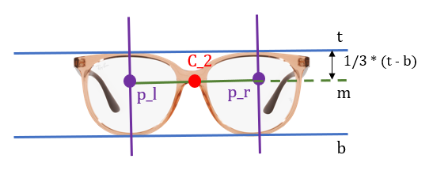

# Glasses Virtual Try-On System

## Overview

This virtual try-on system overlays glasses onto a selfie image using facial landmarks. It aims to position the glasses naturally on the nose bridge, respecting the geometry and size of the user’s face.

Here, how to overlay the glasses onto selfie according to the geometry of face and glasses is explained.

And the full python implementation is wrritten in demo/kernel_codes_demo.ipynb which you can test your slfie and glasses url directly.
---

## Technical Workflow

### Step 1: Detect Face Center ($C_1$)

- **Goal**: Accurately locate the point on the selfie where the glasses should be centered.
- **Definition**: The face center ($C_1$) is defined as the intersection of:
  - x: The line connecting the centers of the left and right pupils.
  - y: The nose bridge line between the nose root and the nose tip.
- **Reasoning**: This ensures the glasses are aligned to the natural position on the nose bridge, independent of face shape or symmetry.

  

### Step 2: Remove Lenses

- Removes the lenses area (including temples / arms inside) from the glasses image and make it transparent using HSV color thresholding.
- Applies convex hulls to create a cleaner mask, ensuring the eye area remains visible after overlay.

  

### Step 3: Compute Glasses Center ($C_2$)

- **Goal**: Compute the logical center of the glasses image.
- **Definition**: $C_2$ is the midpoint of a line drawn between two points:
  - p_l: The top-third height point of the left lens.
  - p_r: The top-third height point of the right lens.
- **Reasoning**: This placement ensures the center is close to the nose pad area, enabling natural alignment with $C_1$.

  

### Step 4: Rotation & Scaling

- **Rotation**: The glasses are rotated to match the tilt of the eye line (between the two pupils).
- **Scaling**: Glasses are resized to match the facial width by aligning the frame hinge (temple area) with the ears.
  - This is done by computing the Euclidean distance between the user's ears.
  - Maintains aspect ratio while resizing.

  

### Step 5: Overlay Glasses

- The glasses image is finally overlaid onto the selfie with galsses center $C_1$ overlaid at facial center $C_1$.
- Alpha blending is used to ensure realistic transparency and avoid hard edges.

  

---

## Facial Landmarks Used (via MediaPipe)

| Landmark | Index |
|----------|-------|
| Left Eye Center | 33 & 133 |
| Right Eye Center | 362 & 263 |
| Nose Tip | 1 |
| Nose Root | 168 |
| Left Ear | 234 |
| Right Ear | 454 |

---

## Code Structure

### Key Functions

#### `get_keypoints(face_img)`
Detects facial landmarks and returns critical facial keypoints.

#### `compute_glasses_center(img_rgba)`
Calculates the logical visual center ($C_2$) of the glasses image.

#### `remove_lens_region(img_rgba)`
Removes the glasses' lens region (including anything inside, like temple arms) and make lens region transparent by setting those areas to transparent (alpha = 0) for better try-on realism.

#### `rotate_galsses_image(img_rgba, angle)`
Rotates the glasses image around its center with specific angle.

#### `overlay_images(glasses, face, x, y)`
Overlays the transformed RGBA glasses image onto the BGR selfie image at position (x, y).

#### `main_tryon(selfie_path, glasses_url)`
The main pipeline for:
1. Loading images
2. Detecting facial keypoints
3. Processing the glasses image
4. Rotating and resizing the glasses
5. Overlaying two processed images to gennerate the final result

---

## Assumptions & Design Choices
- The glasses image has the alpha channel
- The glasses must always be centered on the **nose bridge** — this avoids drift from eye misalignment or face shape variance.
- The **scaling** is derived from facial proportions (distance between ears), ensuring size adaptation for different face sizes.
- The **rotation** uses the angle between the eys to naturally tilt the glasses according to the user's face posture.
- Bright lens areas are assumed to be **near white (HSV: H=0–180, S=0–30, V>200)**, which works well for most product images.

---

## Output Example

- The result is a photo-realistic overlay of the glasses on the user's selfie.
- Glasses maintain correct orientation, size, and transparency.
- Glasses hinge are correctly placed **around the ear area** when scaled properly.

---

## Future Improvements

- Advanced lens rendering with refraction or lighting simulation, making try-on more realistic.
- Scale the size of the glasses more intelligently and accurately based on different face widths.Becuase some people have has smaller faces and others have larger ones. Therefore, the same pair of galsses appears small on a large face and large on a small face.
- Render the galsses temples / arms behind the earss properly when the face tilts left or right.
- Support for multiple faces in one image.
- Real-time integration using webcam.
- 3D glasses fitting using depth estimation.

---

## Dependencies

- Python 3.10+
- NumPy
- **OpenCV**
- **MediaPipe**
- Matplotlib (for debugging and visualization)

---

## Example Usage

```python
# The glasses image must have alpha channel.
main_tryon("your_selfie.jpg", "https://your-cdn.com/your_glasses_url.png")
```